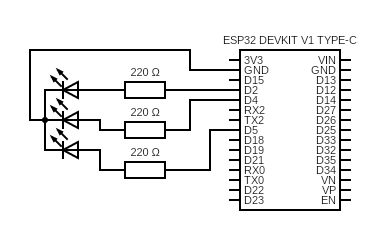
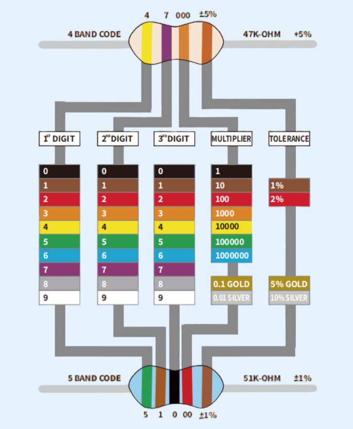
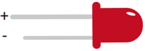
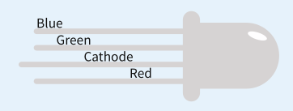
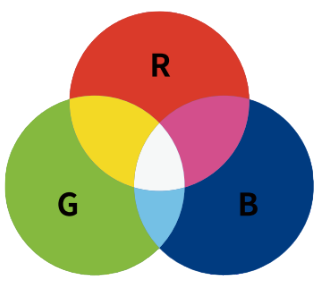

# Electronics 101 (Day 1) — Cheat Sheet

## Table of Contents

- [ESP32 — Voltage basics](#esp32--voltage-basics)
- [GPIO pins](#gpio-pins)
- [Ohm's Law](#ohms-law)
- [Why a resistor before an LED?](#why-a-resistor-before-an-led)
- [Parallel circuit](#parallel-circuit)
- [Voltage drop](#voltage-drop)
- [Short circuit](#short-circuit)
- [Breadboard](#breadboard)
- [Resistors](#resistors)
- [LEDs](#leds)
- [Flashing the ESP32 with Arduino IDE](#flashing-the-esp32-with-arduino-ide)
- [Arduino functions used](#arduino-functions-used)

---

https://github.com/user-attachments/assets/215b9ac4-0047-4a70-8be9-d7ccd5b95114



## ESP32 — Voltage basics

- Power input: USB-C (5V) or Vin pin (5-12V max)
- Internal voltage: **3.3V** (onboard LDO regulator)
- ⚠️ All GPIO pins operate at **3.3V max** — never send 5V into a GPIO

## GPIO pins

- Voltage: **3.3V**
- Max current per pin: **12mA** recommended (40mA absolute max)
- Bidirectional: input (sensors) or output (LEDs, signals)

## Ohm's Law

```
V = R × I
```

- V = voltage in Volts
- R = resistance in Ohms
- I = current in Amperes

## Why a resistor before an LED?

Without a resistor, an LED lets through nearly unlimited current → the GPIO burns out.  
The resistor limits current to stay under 12mA.

**Calculation:**

```
R = (V_gpio - V_led) / I_target
R = (3.3V - 2V) / 0.01A = 130Ω minimum
```

→ 220Ω is a common and safe value.

## Parallel circuit

- Voltage is **identical** across every branch
- Each branch is **independent** — removing one doesn't affect the others
- Each LED gets its own resistor

## Voltage drop

- Each component "consumes" part of the voltage
- The sum of all drops = total voltage
- The resistor absorbs what's left after the LED:  
  `V_resistor = V_gpio - V_led`

## Short circuit

A direct wire between + and GND with no component in between = near-infinite current = burned components.  
→ Always have at least one resistor in the path.

## Breadboard

- **± rails (red/blue)**: connected along the full length — use for + and GND distribution
- **Central zone (a-e / f-j)**: each row is connected in groups of 5
- The center gap breaks the connection between both halves
- Components straddle the gap

## Resistors



_Each color band represents a digit — read them in order to get the resistance value in Ohms._

## LEDs

### Anode & Cathode

- **Anode** = positive leg (+) — where current enters the component
- **Cathode** = negative leg (-) — where current exits

### Simple LED



_Long leg = Anode (+), short leg = Cathode (-)_

### RGB LED



_Longest leg = common Cathode (-) — connect to GND_



_Additive color mixing: R + G + B = white_

## Flashing the ESP32 with Arduino IDE

1. Install Arduino IDE + ESP32 core (via Boards Manager)
2. Connect ESP32 via USB-C
3. Select: Board → "ESP32 Dev Module" / Port → `/dev/ttyUSB0`
4. Click "Upload"
5. If connection fails: hold the **BOOT** button during upload

---

## Arduino functions used

| Function                      | Purpose                                             |
| ----------------------------- | --------------------------------------------------- |
| `pinMode(pin, OUTPUT)`        | Sets a GPIO as output                               |
| `digitalWrite(pin, HIGH/LOW)` | Sets a GPIO output to HIGH (3.3V) or LOW (0V)       |
| `analogWrite(pin, 0-255)`     | Outputs a PWM signal to control intensity           |
| `delay(ms)`                   | Pauses execution for a given number of milliseconds |
