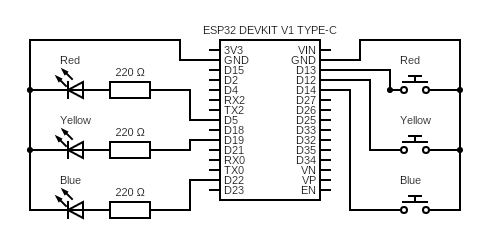

# Electronics 101 (Day 2) — Cheat Sheet

## Table of Contents

- [Push buttons (tactile switches)](#push-buttons-tactile-switches)
- [Floating pin](#floating-pin)
- [Pull resistors (pull-up / pull-down)](#pull-resistors-pull-up--pull-down)
- [Mechanical bouncing](#mechanical-bouncing)
- [Falling edge detection](#falling-edge-detection)
- [PWM — Pulse Width Modulation](#pwm--pulse-width-modulation)
- [GND is shared](#gnd-is-shared)
- [Arduino functions used](#arduino-functions-used)

---

https://github.com/user-attachments/assets/f3faefaf-c0a9-407c-8abc-70572b74de54



## Push buttons (tactile switches)

- A button is a simple switch: pressed = circuit closed, released = circuit open
- Tactile switches have 4 pins but only 2 electrical connections (A-D are linked together, B-C are linked together)
- Wire one side to a GPIO, the other side to **GND**
- **No resistor needed**: no continuous current flows — the GPIO is just momentarily connected to GND

## Floating pin

An unconnected input GPIO picks up electromagnetic noise from the environment and reads random HIGH/LOW values.  
→ Always define a stable default state using a pull resistor.

## Pull resistors (pull-up / pull-down)

A pull resistor forces a GPIO to a known stable state when nothing is connected.

- **Pull-up**: ties the GPIO to VCC (3.3V) → default state is HIGH
- **Pull-down**: ties the GPIO to GND → default state is LOW

The ESP32 has built-in pull-up resistors (~45kΩ) that can be enabled in software — no external resistor needed for buttons.

⚠️ With pull-up, logic is **inverted**: button pressed = LOW, button released = HIGH.

## Mechanical bouncing

Metal contacts don't close cleanly in a single transition.  
They physically bounce for ~5-20ms, generating a burst of spurious HIGH/LOW transitions.

```
HIGH ──┐ ┌─┐ ┌─┐ ┌──── stable LOW
       └─┘ └─┘ └─┘
    <-- ~5-20ms -->
```

→ Without handling, a single press can be detected multiple times.  
→ Solution: ignore state changes for ~30-50ms after the first transition (**debouncing**).

## Falling edge detection

Instead of reading the raw button state continuously, detect the **moment** it transitions from HIGH to LOW.  
→ Triggers an action **exactly once** per press, regardless of how long the button is held.

## PWM — Pulse Width Modulation

A GPIO cannot output a voltage between 0V and 3.3V directly.  
PWM simulates a variable voltage by **switching the signal on and off very rapidly**.

- Typical frequency: hundreds to thousands of Hz (invisible to the eye)
- **Duty cycle**: percentage of time the signal is HIGH
  - 0% → always LOW → LED off
  - 50% → half the time HIGH → LED at half brightness
  - 100% → always HIGH → LED full brightness

→ Controls LED brightness without changing the resistor.

## GND is shared

All GND pins on the ESP32 are the same electrical point.  
Any GND pin on either side of the board can be used in the same circuit.  
→ Use the GND closest to each component to keep wiring clean.

---

## Arduino functions used

| Function                     | Purpose                                         |
| ---------------------------- | ----------------------------------------------- |
| `pinMode(pin, INPUT_PULLUP)` | Enables the internal pull-up resistor on a GPIO |
| `digitalRead(pin)`           | Reads a GPIO state: HIGH or LOW                 |
| `analogWrite(pin, 0-255)`    | Outputs a PWM signal to control intensity       |
| `millis()`                   | Returns time elapsed since boot in milliseconds |
