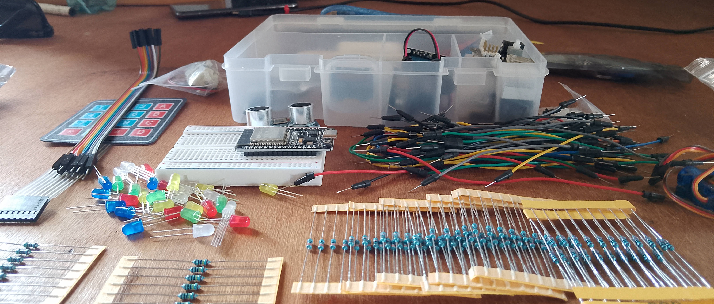

# Electronics 101

**A personal learning journal — from zero electronics knowledge to embedded systems, one session at a time.**

- Hardware: ESP32 DevKit V1 + Elegoo starter kit components, including:
  - LEDs, resistors, and push buttons
  - Sensors: DHT11 (temperature & humidity), photoresistor (light sensor), ultrasonic sensor (HC-SR04), potentiometer
  - Motors / Actuators: DC motors with motor driver, servo motors
  - Buzzer, LCD display, jumper wires, breadboard
- Software: Arduino IDE / C++
- Circuits schematics are made with Circuit Diagram: [see my profile](https://www.circuit-diagram.org/user/18eebd14-f304-4021-9674-05b5629c26ef)

---

## Sessions

| #                               | Date       | Topics                                                                       |
| ------------------------------- | ---------- | ---------------------------------------------------------------------------- |
| [01](2026-04-05_LED_RGB)        | 2026-04-05 | Ohm's Law, resistors, LEDs, RGB LED, breadboard basics, flashing ESP32       |
| [02](2026-04-06_digital-inputs) | 2026-04-06 | Push buttons, pull-up resistors, floating pin, debouncing, falling edge, PWM |

---

_Each session folder contains a README cheat sheet, source code, and reference images._
